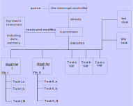

# Conceptual view

This tries to provide a high level view of how tasks are managed in
the RTIC context. It focuses on the execution flow.

At its core, RTIC leverages the NVIC subsystem of the machine to
enable time-deterministic control of code execution.

There are two queues to think about.

One queue is a software queue, which is a a set of FIFOs written in
code and managed by the RTIC framework. Individual FIFOs are
associated with different execution priority levels.

The other is a hardware-controlled queue maintained by the NVIC. If
there are two hardware interrupts pending, the highest priority code
will execute first: a "priority queue" at a hardware level.

The NVIC operates essentially independently of the CPU, outside of
the various masking and other registers that the CPU can use to ignore
specific interrupt sources.

(Are HW interrupts always of different priority? Does the HW maintain
memory of lower or same priority level interrupts to process them once
they become eligible?)

So, a hardware task initiated by and bound to a hardware interrupt is
controlled by the NVIC's queuing mechanism without direct involement
of the processor; a software-spawned task just gets put into the task
FIFO (at some priority level) for later execution whenever the current
execution priority level is low enough. If a hardware or software task
completes, RTIC checks the software queue for more tasks to run,
eventually completing all until the queue exhausts and the IDLE task
then takes over again.

The CPU's ability to set a "minimum priority level" of hardware
interrupts allows alignment of the software and hardware queues. This
masks hardware-level interrupts coming in while equal or higher
priority level software tasks are exectuting. It makes the NVIC keep
the hardware tasks interrupt pending until the software task ends (and
the CPU has lowered the minimum priority level of interrupt acceptance).

## Hardware queue: NVIC

There is a difference between a software-initiated context switch
(which is a function call in code) and an interrupt (NVIC) initiated
switch. When the NVIC generates an interrupt request, this physically
breaks the execution flow of the processor.

## Software queue: task dispatchers

The software queues are maintained by task dispatchers. They can be
thought of as "pre-wired" hardware tasks initiated by the NVIC.

Each task dispatcher keeps a queue of tasks which are ready to
execute; this queue is referred to as the ready queue. Spawning a
software task consists of adding an entry to this queue and pending
the interrupt that runs the corresponding task dispatcher. Each entry
in this queue contains a tag (enum) that identifies the task to
execute and a pointer to the message passed to the task.

You can think of the dispatchers as just calling the SW tasks as
functions.

The ready queue is a SPSC (Single Producer Single Consumer) lock-free
queue. The task dispatcher owns the consumer endpoint of the queue;
the producer endpoint is treated as a resource contended by the tasks
that can spawn other tasks.  source: [Software tasks - Real-Time
Interrupt-driven
Concurrency](https://rtic.rs/0.5/book/en/internals/tasks.html).

## spawning

Any task may influence the execution context via the "spawn" API,
adding tasks to the queues for later execution.

The defined priority of the task spawned determines the queue it lands
in.
