RTIC

<h1 align="center">The hardware accelerated Rust RTOS</h1>

A concurrency framework for building real-time systems

# Preface

This book contains user level documentation for the Real-Time Interrupt-driven Concurrency
(RTIC) framework. The API reference is available [here](../../api/).

This is the documentation for RTIC v2.x. 

Older releases:
[RTIC v1.x](/1) | [RTIC v0.5.x (unsupported)][v0_5] | [RTFM v0.4.x (unsupported)][v0_4] 

[v0_5]: https://github.com/rtic-rs/rtic/tree/release/v0.5
[v0_4]: https://github.com/rtic-rs/rtic/tree/release/v0.4

{{#include ../../../README.md:7:12}}

## Is RTIC an RTOS?

A common question is whether RTIC is an RTOS or not, and depending on your background the answer may vary. From RTIC's developers point of view; RTIC is a hardware accelerated RTOS that utilizes the hardware such as the NVIC on Cortex-M MCUs, CLIC on RISC-V etc. to perform scheduling, rather than the more classical software kernel.

Another common view from the community is that RTIC is a concurrency framework as there
is no software kernel and that it relies on external HALs.

## RTIC - The Past, current and Future

This section gives a background to the RTIC model. Feel free to skip to section [RTIC the model](preface.md#rtic-the-model) for a TL;DR.

The RTIC framework takes the outset from real-time systems research at Luleå University of Technology (LTU) Sweden. RTIC is inspired by the concurrency model of the [Timber] language, the [RTFM-SRP] based scheduler, the [RTFM-core] language and [Abstract Timer] implementation. For a full list of related research see [TODO].

[Timber]: https://timber-lang.org/
[RTFM-SRP]: https://www.diva-portal.org/smash/get/diva2:1005680/FULLTEXT01.pdf
[RTFM-core]: https://ltu.diva-portal.org/smash/get/diva2:1013248/FULLTEXT01.pdf
[Abstract Timer]: https://ltu.diva-portal.org/smash/get/diva2:1013030/FULLTEXT01.pdf

## Stack Resource Policy based Scheduling

[Stack Resource Policy (SRP)][SRP] based concurrency and resource management is at heart of the RTIC framework. The SRP model itself extends on [Priority Inheritance Protocols], and provides a set of outstanding properties for single core scheduling. To name a few:

- preemptive deadlock and race-free scheduling
- resource efficiency
  - tasks execute on a single shared stack
  - tasks run-to-completion with wait free access to shared resources
- predictable scheduling, with bounded priority inversion by a single (named) critical section
- theoretical underpinning amenable to static analysis (e.g., for task response times and overall schedulability)

SRP comes with a set of system-wide requirements:
- each task is associated a static priority,
- tasks execute on a single-core,  
- tasks must be run-to-completion, and
- resources must be claimed/locked in LIFO order.

[SRP]: https://link.springer.com/article/10.1007/BF00365393
[Priority Inheritance Protocols]: https://ieeexplore.ieee.org/document/57058

## SRP analysis

SRP based scheduling requires the set of static priority tasks and their access to shared resources to be known in order to compute a static *ceiling* (𝝅) for each resource. The static resource *ceiling* 𝝅(r) reflects the maximum static priority of any task that accesses the resource `r`. 

### Example

Assume two tasks `A` (with priority `p(A) = 2`) and `B` (with priority `p(B) = 4`) both accessing the shared resource `R`. The static ceiling of `R` is 4 (computed from `𝝅(R) = max(p(A) = 2, p(B) = 4) = 4`).  

A graph representation of the example:

```mermaid
graph LR
    A["p(A) = 2"] --> R
    B["p(A) = 4"] --> R
    R["𝝅(R) = 4"]
```

## RTIC the hardware accelerated real-time scheduler

SRP itself is compatible with both dynamic and static priority scheduling. For the implementation of RTIC we leverage on the underlying hardware for accelerated static priority scheduling.

In the case of the `ARM Cortex-M` architecture, each interrupt vector entry `v[i]` is associated a function pointer (`v[i].fn`), and a static priority (`v[i].priority`), an enabled- (`v[i].enabled`) and a pending-bit (`v[i].pending`). 

An interrupt `i` is scheduled (run) by the hardware under the conditions:
1. is `pended` and `enabled` and has a priority higher than the (optional `BASEPRI`) register, and
1. has the highest priority among interrupts meeting 1.

The first condition (1) can be seen a filter allowing RTIC to take control over which tasks should be allowed to start (and which should be prevented from starting).

The SPR model for single-core static scheduling on the other hand states that a task should be scheduled (run) under the conditions:
1. it is `requested` to run and has a static priority higher than the current system ceiling (𝜫)
1. it has the highest static priority among tasks meeting 1.

The similarities are striking and it is not by chance/luck/coincidence. The hardware was cleverly designed with real-time scheduling in mind. 

In order to map the SRP scheduling onto the hardware we need to take a closer look at the system ceiling (𝜫). Under SRP 𝜫 is computed as the maximum priority ceiling of the currently held resources, and will thus change dynamically during the system operation.

## Example

Assume the task model above. Starting from an idle system, 𝜫 is 0, (no task is holding any resource). Assume that `A` is requested for execution, it will immediately be scheduled. Assume that `A` claims (locks) the resource `R`. During the claim (lock of `R`) any request `B` will be blocked from starting (by 𝜫 = `max(𝝅(R) = 4) = 4`, `p(B) = 4`, thus SRP scheduling condition 1 is not met).

## Mapping

The mapping of static priority SRP based scheduling to the Cortex M hardware is straightforward:

- each task `t` are mapped to an interrupt vector index `i` with a corresponding function `v[i].fn = t` and given the static priority `v[i].priority = p(t)`. 
- the current system ceiling is mapped to the `BASEPRI` register or implemented through masking the interrupt enable bits accordingly.

## Example

For the running example, a snapshot of the ARM Cortex M [Nested Vectored Interrupt Controller (NVIC)][NVIC] may have the following configuration (after task `A` has been pended for execution.)

| Index | Fn  | Priority | Enabled | Pended |
| ----- | --- | -------- | ------- | ------ |
| 0     | A   | 2        | true    | true   |
| 1     | B   | 4        | true    | false  |

[NVIC]: https://developer.arm.com/documentation/ddi0337/h/nested-vectored-interrupt-controller/about-the-nvic

(As discussed later, the assignment of interrupt and exception vectors is up to the user.)

A claim (lock(r)) will change the current system ceiling (𝜫) and can be implemented as a *named* critical section: 
  - old_ceiling = 𝜫, 𝜫 = 𝝅(r)  
  - execute code within critical section
  - old_ceiling = 𝜫

This amounts to a resource protection mechanism requiring only two machine instructions on enter and one on exit the critical section for managing the `BASEPRI` register. For architectures lacking `BASEPRI`, we can implement the system ceiling through a set of machine instructions for disabling/enabling interrupts on entry/exit for the named critical section. The number of machine instructions vary depending on the number of mask registers that needs to be updated (a single machine operation can operate on up to 32 interrupts, so for the M0/M0+ architecture a single instruction suffice). RTIC will determine the ceiling values and masking constants at compile time, thus all operations is in Rust terms zero-cost.

In this way RTIC fuses SRP based preemptive scheduling with a zero-cost hardware accelerated implementation, resulting in "best in class" guarantees and performance. 

Given that the approach is dead simple, how come SRP and hardware accelerated scheduling is not adopted by any other mainstream RTOS?

The answer is simple, the commonly adopted threading model does not lend itself well to static analysis - there is no known way to extract the task/resource dependencies from the source code at compile time (thus ceilings cannot be efficiently computed and the LIFO resource locking requirement cannot be ensured). Thus, SRP based scheduling is in the general case out of reach for any thread based RTOS. 

## RTIC into the Future

Asynchronous programming in various forms are getting increased popularity and language support. Rust natively provides an `async`/`await` API for cooperative multitasking and the compiler generates the necessary boilerplate for storing and retrieving execution contexts (i.e., managing the set of local variables that spans each `await`). 

The Rust standard library provides collections for dynamically allocated data-structures which are useful to manage execution contexts at run-time. However, in the setting of resource constrained real-time systems, dynamic allocations are problematic (both regarding performance and reliability - Rust runs into a *panic* on an out-of-memory condition). Thus, static allocation is the preferable approach!

RTIC provides a mechanism for `async`/`await` that relies solely on static allocations. However, the implementation relies on the `#![feature(type_alias_impl_trait)]` (TAIT) which is undergoing stabilization (thus RTIC v2.x currently requires a *nightly* toolchain). Technically, using TAIT, the compiler determines the size of each execution context allowing static allocation.

From a modelling perspective `async/await` lifts the run-to-completion requirement of SRP, and each section of code between two yield points (`await`s) can be seen as an individual task. The compiler will reject any attempt to `await` while holding a resource (not doing so would break the strict LIFO requirement on resource usage under SRP).

So with the technical stuff out of the way, what does `async/await` bring to the table?

The answer is - improved ergonomics! A recurring use case is to have task perform a sequence of requests and then await their results in order to progress. Without `async`/`await` the programmer would be forced to split the task into individual sub-tasks and maintain some sort of state encoding (and manually progress by selecting sub-task). Using `async/await` each yield point (`await`) essentially represents a state, and the progression mechanism is built automatically for you at compile time by means of `Futures`. 

Rust `async`/`await` support is still incomplete and/or under development (e.g., there are no stable way to express `async` closures, precluding use in iterator patterns). Nevertheless, Rust `async`/`await` is production ready and covers most common use cases. 

An important property is that futures are composable, thus you can await either, all, or any combination of possible futures (allowing e.g., timeouts and/or asynchronous errors to be promptly handled). For more details and examples see Section [todo].

## RTIC the model

An RTIC `app` is a declarative and executable system model for single-core applications, defining a set of (`local` and `shared`) resources operated on by a set of (`init`, `idle`, *hardware* and *software*) tasks. In short the `init` task runs before any other task returning a set of resources (`local` and `shared`). Tasks run preemptively based on their associated static priority, `idle` has the lowest priority (and can be used for background work, and/or to put the system to sleep until woken by some event). Hardware tasks are bound to underlying hardware interrupts, while software tasks are scheduled by asynchronous executors (one for each software task priority). 

At compile time the task/resource model is analyzed under SRP and executable code generated with the following outstanding properties:

- guaranteed race-free resource access and deadlock-free execution on a single-shared stack (thanks to SRP)
  - hardware task scheduling is performed directly by the hardware, and
  - software task scheduling is performed by auto generated async executors tailored to the application.

The RTIC API design ensures that both SRP requirements and Rust soundness rules are upheld at all times, thus the executable model is correct by construction. Overall, the generated code infers no additional overhead in comparison to a handwritten implementation, thus in Rust terms RTIC offers a zero-cost abstraction to concurrency.
