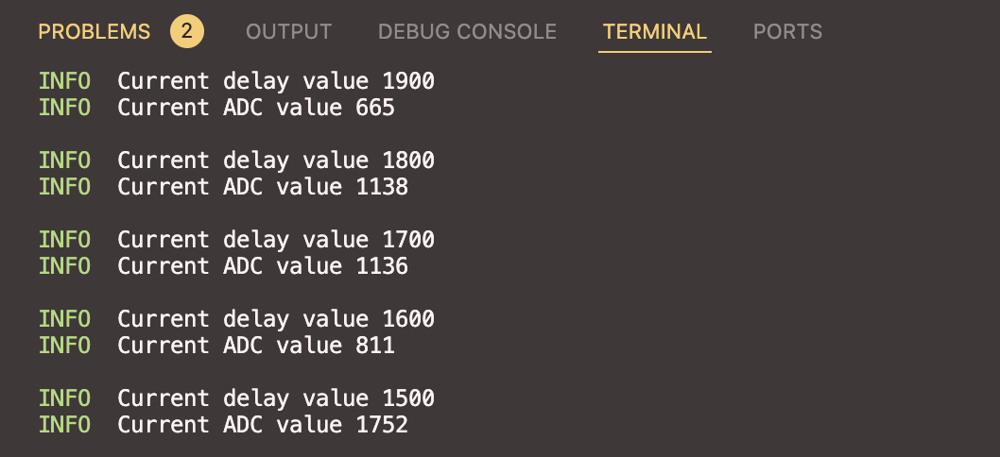

# STM32F411CEU6 ADC example 
Working example to work with the internal ADC of the STM32F411CEU6 present on a Blackpill board.  

The `#init` task configures the ADC module for single-shot conversion and `PA1` as analog pin.  

Afterwards, the analog pin stored in a Potentiometer struct is set as a **local** resource to the hardware task associated to `EXTI0`.  

The `Adc<ADC1>` instance on the other hand, is set as a **shared** resource. The reason behind this approach is to allow other tasks make use of the only ADC module present on this microcontroller.  

## How-to

### Build
Run `cargo build --release` to compile the code. If you run it for the first time, it will take some time to download and compile dependencies.

### Run
Install `probe-rs` and configure it using the [debugging extension for VScode](https://probe.rs/docs/tools/debugger/).  
The output should look like this 
