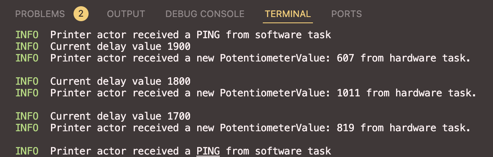

# STM32F411CEU6 ADC example 
This example is a continuation of the **stm32f411_adc**.
In this variant, there are 3 tasks (1 HW & 2 SW) involved and communication between them by means of an MPSC channel.

In the `#[init]` before spawning any task, an MPSC channel is created and splitted in its two parts.  
Immediately after separating the `Receiver` and `Sender` the software task `printer_actor` is spawned and receives the `Receiver` end of the channel and starts listening.  

Then two clones of the `Sender` type are created. The first one is stored as Local resource for the HW task and the second, is passed as an argument when the `pinger` software task is spawned.

## Hardware task bound to EXTI0: `gpio_interrupt_handler`
This task,
 - Decreases the value of __delayval__ by 200
 - Takes a new sample from the ADC input connected on pin `PA1`
 - Sends a message of type `Message::PotentiometerValue` to the printer task
 - Clears the interrupt_pending_bit

## Software task: `printer_actor`
This task makes use of the unused interrupt __SPI1__ as a dispatcher. Since it is an async fn, it ia constantly awaiting for incoming messages from other actors.
Depending on the type of message received, it prints something different.

## Software task: `pinger`
This is just a simple task that sends ping every 25000 millis and uses __SPI2__ as a dispatcher.

## How-to

### Build
Run `cargo build --release` to compile the code. If you run it for the first time, it will take some time to download and compile dependencies.

### Run
Install `probe-rs` and configure it using the [debugging extension for VScode](https://probe.rs/docs/tools/debugger/).  
The output should look like this 
